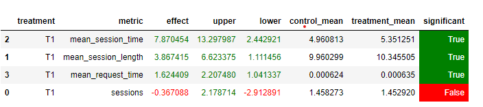

## Рекоммендер
Был взят Contextual рекоммендер с семинара с некоторыми изменениями:
* В качестве fallback используется TopPop с 100 топ треками
* Прослушанные треки сохраняются в словарь и больше не рекомендуются в рамках сессии
* Если трек прослушан менее, чем на 0.5, то вызывается fallback

# Неудачные эксперименты
* Была попытка в качестве fallback использовать Collaborative, внутри которого используется TopPop, но почему-то так результаты сильно хуже :(
* В модель с семинара добавляла фичи и сортировала результат по релевантности, но тоже получилось хуже

## Результат

## Как запускать
* Поднимаем контейнер: docker-compose up -d --build
* Запускаем симулятор: python sim/run.py --episodes 6000 --recommender remote --config config/env.yml --seed 31337
* Сохраняем себе логи: docker cp recommender-container:/app/log/ logs
* Переходим в папку lods и переносим логи на в hdfs: python ../script/dataclient.py --user mob202203 log2hdfs --cleanup my9.json
* На кластере запускаем ноут AB_notebook.ipynb